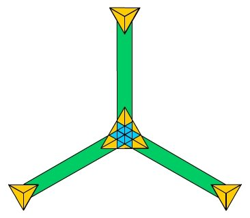

Use Cases and Requirements for Web Payments on Mobile
==================

This document outlines the use cases and requirements we payments on mobile. The use cases and requirements were gathered by gathering data on web and native applications with payment functionality, as well as looking at native payment platforms. 

## Motiviation
The main questions this document seeks to expore are:
* What functionality is being achieved by native payment applications and platforms which is missing from the web?
* What functionality is being offered through proprietary plugins to the web for payments?
* What methods of payments are being offered to users through these other methods of payments?

On March 24-25 the W3C will hold a [Workshop on Web Payments](http://www.w3.org/2013/10/payments/Overview.html). We have been asked to submit our use cases to help define the work the W3C will do on web payments in the future. 

## Payment Methods

The following are examples of applications across web, iOS, Android and Windows Phone that allow users to pay for goods or services via various methods. 

### Paypal - Web, iOS, Android, Windows
Paypal allows users to pay for goods and services, send money and manage a wallet system from the web and iOS, Android, Windows and native applications.

__Paypal Use Cases__
* Send money to other users (identifying the users via email)
* Pay for goods and services from third parties
* Pay for goods and services in store from third parties
* Add funds via a 'wallet' system
* Withdraw funds via a 'wallet' system
* Pay via wallet system
* Pay using credit and debit card
* Link and pay by a bank acocunt
* Link mobile phone number to account and use for pay receipts.

__Region & Currencies__

Worldwide and multi-currency.

__For Developers__

[SDK](https://developer.paypal.com/webapps/developer/docs/integration/mobile/mobile-sdk-overview/) for Android and iOS applications:
* UI that accepts a PayPal or credit card payment from the user
* Coordinate the payment with PayPal
* Return to proprieter a proof of payment.

 
 

### Google - Web, iOS, Android, Windows
Google wallet allows users to pay for goods and services and send money to other users. It also allows merchants to manage loyalty cards 

__Google Wallet Use Cases__
* Send money to other users (identifying the users via email)
* Pay for goods and services online from third parties
* Pay for goods and services in store from third parties
* Add funds via a 'wallet' system
* Withdraw funds via a 'wallet' system
* Pay via wallet system
* Pay using credit and debit card
* Manage loyalty schemes

__Region & Currencies__

Worldwide and multi-currency.

__For Developers__

[APIs](https://developers.google.com/wallet/):
* Payment for goods and services on third party apps
* Loyalty programmes
* Digital payments
* 

 
 

## Other Use Cases
Here are some other use cases not detailed in the above examples.

--Test of Markdown-- __Test__

##More Testing Use Cases

