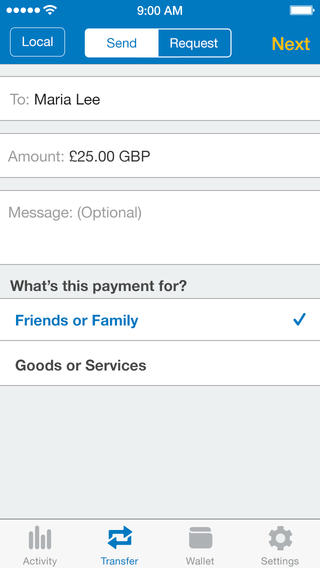
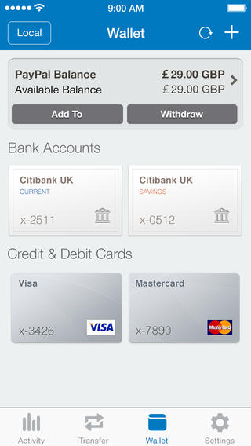
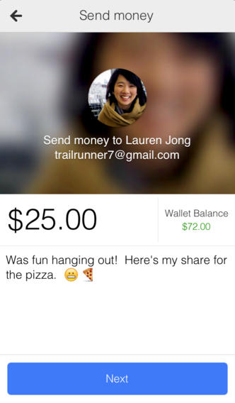
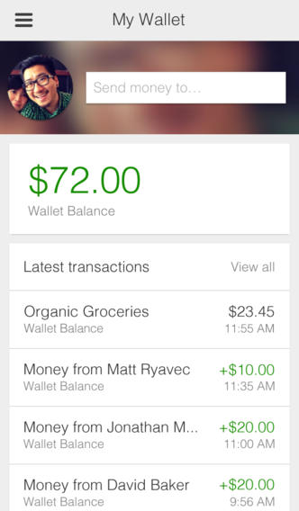
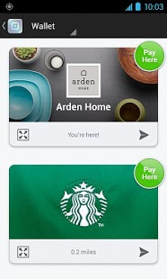
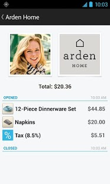
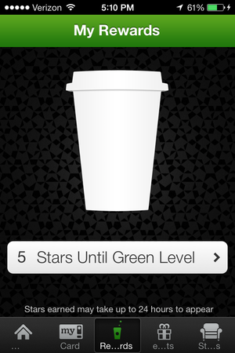
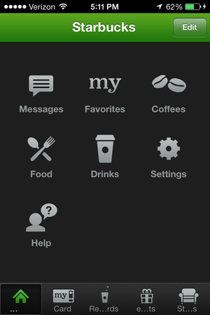
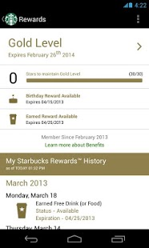
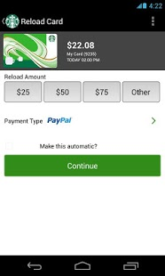

Use Cases and Requirements for Web Payments on Mobile
==================

This document outlines the use cases and requirements for payments on mobile. The use cases and requirements were gathered by gathering data on web and native applications with payment functionality, as well as looking at native payment platforms. 

## Motivation
The main questions this document seeks to expore are:
* What functionality is being achieved by native payment applications and platforms which is missing from the web?
* What functionality is being offered through proprietary plugins to the web for payments?
* What methods of payments are being offered to users through these other methods of payments?

On March 24-25 the W3C will hold a [Workshop on Web Payments](http://www.w3.org/2013/10/payments/Overview.html). We have been asked to submit our use cases to help define the work the W3C will do on web payments in the future. 

## Payment Methods

The following are examples of applications across web, iOS, Android and Windows Phone that allow users to pay for goods or services via various methods. 

### Paypal - Web, iOS, Android, Windows
Paypal allows users to pay for goods and services, send money and manage a wallet system from the web and iOS, Android, Windows and native applications.

__Use Cases__
* Send money to other users (identifying the users via email)
* Pay for goods and services from third parties
* Pay for goods and services in store from third parties
* Add funds via a 'wallet' system
* Withdraw funds via a 'wallet' system
* Pay via wallet system
* Pay using credit and debit card
* Link and pay by a bank acocunt
* Link mobile phone number to account and use for pay receipts
* Send money to almost anyone with an email or mobile number
* Request money (payment made using any method - credit card, etc.)
* Turn mobile device into a register, in store or on the go. Accept cards, checks, and PayPal.
* Automatic foreign exchange
* Invoices that don't require payer to get a PayPal account

__Region & Currencies__

Worldwide and multi-currency.

__For Developers__

[SDK](https://developer.paypal.com/webapps/developer/docs/integration/mobile/mobile-sdk-overview/) for Android and iOS applications:
* UI that accepts a PayPal or credit card payment from the user
* Coordinate the payment with PayPal
* Return to proprieter a proof of payment.

 
 

### Google - Web, iOS, Android, Windows
Google wallet allows users to pay for goods and services and send money to other users. It also allows merchants to manage loyalty cards 

__Google Wallet Use Cases__
* Send money to other users (identifying the users via email)
* Pay for goods and services online from third parties
* Pay for goods and services in store from third parties
* Add funds via a 'wallet' system
* Withdraw funds via a 'wallet' system
* Pay via wallet system
* Pay using credit and debit card
* Manage loyalty schemes

__Region & Currencies__

Worldwide and multi-currency.

__For Developers__

[APIs](https://developers.google.com/wallet/):
* Payment for goods and services on third party apps
* Loyalty programmes
* Digital payments

 
 

### Web Payments / PaySwarm - PLATFORMS?
[https://web-payments.org/specs/](https://web-payments.org/specs/)

__Use Cases__

* Add money to PaySwarm Authority from credit card or bank account
* Mobile Computing-based Purchase (NFC, Bluetooth LE) 
* Point-of-Sale Device (Routing of purchase requests by vendor) 
* Ability to re-sell digital content (automatic redistribution licenses) 
* Conditional Redistribution (enable redistribution only when certain parameters are met - smart contracts) 
* Buy a product online through the use of a PaySwarm button in a web browser
* Complete verifiability (digital signatures on assets, listings, digital receipts, and identity) 

__Region & Currencies__

* Worldwide with any currency (goal)

__For Developers__

Text.

### Web Payments / PaySwarm - PLATFORMS?
[https://web-payments.org/specs/](https://web-payments.org/specs/)

__Use Cases__

* Verifiable identity (Know Your Customer is built-in)
* Simple Web-based Payment Links
* Separated Machine-readable Asset Markup (the Asset) and Pricing Information (the Offer)
* Decentralized, Machine-readable Metadata (Assets and Services)
* Separation of Content from Licenses
* Micropayments to Thousands of Individuals
* Ability to re-sell digital content (automatic redistribution licenses)
* Recurring Payments
* Mobile Computing-based Purchase (NFC, Bluetooth LE)
* Point-of-Sale Device (Routing of purchase requests by vendor)
* Automated Vending (Routing of digital receipts by buyer)
* Currency Exchange (Automatic currency translation)
* Alternative Currencies (Support for Bitcoin, Ripple, Ven, etc.)
* Streaming Payments (Pay-as-you-go - pay based on usage)
* Crowd-funding (all-or-nothing funding models)
* Proof-of-Purchase and Verifiable Digital Receipts
* Conditional Redistribution (enable redistribution only when certain parameters are met - smart contracts)
* Complete verifiability (digital signatures on assets, listings, digital receipts, and identity)

__Region & Currencies__

Text.

__For Developers__

Text.

### Stripe - Web, iOS, Android
[https://stripe.com/](https://stripe.com/)

__Use Cases__
* "Charge your customers in their own local currency"
* "Pay out in any bank account"
* "Accept payments from anyone, anywhere" (e.g. use Stripe Connect to collect transaction fees)
* With Stripe connect, customers do not have to re-enter account information for any of the merchants connected Stripe accounts

'''For Developers:'''

* "A set of unified APIs that instantly enable businesses to accept and manage online payments." 
* "Build platforms with Stripe and offer payments to your users"
* Authentication: authenticate to the Stripe API by providing one of your API keys
* Errors: conventional HTTP response codes to indicate the success or failure of an API request
* Versioning: new versions are released for stripe when the API is changed in a backwards incompatible way
* Expanding: include the ID of another object in the response query
* Metadata: allows for user specified description and metadata
* Charges: an object that is created when a debit or credit card is charged
* Customer: object that allows you to execute recurring charges and track multiple charges for the same customer
* Cards: store multiple cards for a customer for use when needed
* Subscriptions: method for charging of a customers card on a recurring basis
* Plans: pricing information for different products and features on your website
* Coupons, Discounts: listing and application of discounts for customers (loyalty programs?)
* Invoices: "statements of what a customer owes for a particular billing period"
* Invoice Items: add a charge or credit to a customers account, but only perform the action at the end of the regular billing cycle
* Disputes: an object is created when a customer disputes a charge to their bank account or credit card
* Transfers: an object is created when Stripe sends money or a transfer is initiated with a third party bank
* Recipients: "Transfer money from a Stripe account to a third party bank account" (https://stripe.com/docs/api)
* Application Fees: an object is created when a fee is taken from a Stripe account
* Account: see properties of a Stripe Account
* Balance: object representing Stripe Balance
* Events: show interesting things for a Stripe Account
* Tokens: charge credit cards or send payments to bank accounts without holding sensitive information on your servers

__Region & Currencies__

Text.

__For Developers__

Text.

### Intuit GoPayment - PLATFORMS?
[http://www.intuit-gopayment.com/](http://www.intuit-gopayment.com/)

__Use Cases__
* Accept payments through mobile phone by swiping of a credit card on an encrypted card reader
* Allow up to 50 user accounts
* Invalidate charges and send receipts again
* View history and import to Quickbooks
* Apply sales tax with geolocation

__Region & Currencies__

Text.

__For Developers__

Text.

### Square - iOS
[https://squareup.com/](https://squareup.com/)

__Use Cases__
Square Wallet:

* Customers can pay with their phones where square is used.

Square Cash:

* Send and request money for free with the use of a debit card and an e-mail address.

__Region & Currencies__

Text.

__For Developers__

Text.

### Skrill - PLATFORMS?
[https://www.skrill.com/](https://www.skrill.com/) 
(Need to look into mobile)

__Use Cases__
* Connect all your payment options and use them without revealing any financial details
* Bank and credit card details are never revealed
* Send money instantly to anyone with an email address
* Digital wallet

Features:

* Chargeback protection
* Fast integration
* Anti-fraud screening
* Accept secure ‘password only’ payments in 40 currencies from over 36 million people worldwide

__Region & Currencies__

Text

__For Developers__

Text.

### BrainTree - Web, iOS, Windows, Android
[https://www.braintreepayments.com/](https://www.braintreepayments.com/)

__Use Cases__
* Accept payments in your App or Website
* One Touch Payments in mobile with Venmo Touch, no entering personal information or card number
** card information encrypted and stored on BrainTree's servers
* Acceptance of payments in over 130 currencies, and deposit into U.S. bank account in 13 currencies
* Client side encryption of payment information with Braintree.js before being sent to your servers

__Region & Currencies__

Worldwide and multi-currency.

__For Developers__

API:

* Manage credit cards, subscriptions, and transactions
* API libraries in Ruby, PHP, Python, Java, Perl, Microsoft.NET, Node.js
(continue with https://www.braintreepayments.com/docs/node/guide/overview)

### World Pay - Web, iOS, Android
[http://www.worldpay.us/](http://www.worldpay.us/)

__Use Cases__
* In person payment processing solutions 
* Accept debit, credit cards, checks, and electronic benefits transfer
* Counter top terminals, web enabled terminals, and industry specific
* PC compatible magnetic stripe reader and PIN pad with web enabled terminals
* Skip signatures on small tickets
* Split balances between multiple cards to protect from payment fraud
* Accept payments with an Apple or Android phone or tablet with card reader and app
* Feature to key transactions manually
* Accept payments with wireless terminal
* Access to account information through web browser
* World Pay Accounting Plugin For Quickbooks
* Collect recurring payments from your customers' credit cards or bank accounts with ACG direct debit
* Set up payment plans for purchases that customers could not otherwise afford 

Features: 

* End-to-End Encryption from the time the card is swiped to authorization
* PCI compliant
* SSL, tokenization, address verification system, and credit card security code for fraud protection
* Reporting tools:
** Manage Chargebacks
** Real time reporting of recent transaction data such as refunds in addition to authorization amount, settlement date, and more
** Self service tools allow editing of business and account information, management of user accounts, management of terminals, and ordering of supplies
** Four step payment process: payment transmission to WorldPay's processing systems after the card is swiped, authorization by verification of payment details by WorldPay and by an authorization request with the necessary details to the appropriate financial institution, verification by the financial institution through validation of the authorization information and checking whether their are sufficient funds in the customer's account, approval if funds exist and information is correct
* next business day settlement and credit and debit card sales

__Region & Currencies__

Worldwide and multi-currency.

__For Developers__

[APIs](https://developers.google.com/wallet/):
* 

### WePay - iOS
[https://www.wepay.com/](https://www.wepay.com/) 
(need to look into mobile)

"A Flexible Payments API built specifically for Platforms"
--"built for marketplaces, crowdfunding, and small business software"

__Use Cases__
* Let users accept social payments
* Use Oauth2 to let users create a WePay account with a pop-up on your site
* Collect payment information with an embedded form or a custom form
** embedded form handles data validation, PCI compliance, and more
** custom data checkout form to pass credit card to WePay directly where it is stored and given a unique token so customers may be charged in the future
* Use subscriptions to automatically charge customers at regular intervals
* Use delayed payouts to take payments immediately but delay the merchants access to the funds 
* Generate revenue by applying your own transaction fees to payments on your platform
* Deposit payments directly to user's bank accounts

Features: 

* Protection with Veda, a proprietary social risk engine 

__Region & Currencies__

Text.

__For Developers__

API:

* Merchant Category Codes to Classify Businesses
* Instant Payment Notifications to track the state changes of payments, accounts, and other API objects asyncronously

### Balanced Payments - PLATFORMS?
[https://www.balancedpayments.com/](https://www.balancedpayments.com/)

__Use Cases__
* Accept credit cards and ACH debit payments from your customers.
* Use with any card processor or as a stand-alone service for same-day bank deposits.
* Combine card processing and bank payouts with escrow.
* Balanced provides client libraries and a RESTful API for you to easily integrate.
* Decide when to disburse funds
* Define your own fee structure

Features:

* Completely white-labeled
* No monthly fees. No setup fees. No recurring fees.

__Region & Currencies__

Text.

__For Developers__

API:
* Authentication
** Uses HTTPS with a secret key
* API Keys - API Key Secret to Perform Authenticated Requests [properties: create, fetch, list, delete]
* Bank Accounts - resource that represents a bank account [properties: create, fetch, list, update,delete, associate with customer, debit]
* Bank Account Verifications - verify ownership of a bank account using micro-donations [properties: create, fetch and confirm a bank account]
* Callbacks - receive information at a URL of your choice [properties: create, fetch, list, delete]
* Cards
* Card Holds
* Credits
* Customers
* Debits
* Events
* Orders
* Refunds
* Reversals

### 2checkout - PLATFORMS?
[https://www.2checkout.com/](https://www.2checkout.com/)

__Use Cases__
Use Cases:

* Automatic fraud protection
* Accept credit cards and PayPal
* Recurring billing
* REST-based Payment API

Features:

* Monitor account status and history (outgoing, incoming, charts, etc.)
* Works with multiple shopping carts

__Region & Currencies__

Text.

__For Developers__

Text.

### Amazon Payments - PLATFORMS?
[https://payments.amazon.com](https://payments.amazon.com) 
(check for mobile)

__Use Cases__
* Get name, email, zipcode on login via Amazon button
* Buy via mobile
* One-time payments: supports simple one-time payments
* Recurring payments: lets customers schedule recurring payments
* Deferred payments: gives you the control to charge the customer when you want
* Multi-use payments: enables you to charge the customer multiple times based on a single authorization
* Marketplace payments: facilitates multi-payment needs between buyers and sellers in a marketplace
* Micropayments

__Region & Currencies__

Text.

__For Developers__

Text.

### Dwolla - PLATFORMS?
[https://www.dwolla.com/](https://www.dwolla.com/)

__Use Cases__
* Pay friends through email, phone, LinkedIn or Twitter.
* Eliminate paper checks - Cheaper and faster than sending or receiving paper checks.
* Cut out credit card fees.
* Operate as an agent of a financial institution.
* Payments for web and mobile apps - simple payment buttons, an offsite checkout gateway and OAuth + a RESTful API.

Features:

* No percentages. No hidden fees. Just 25¢ per transaction or free for transactions $10 or less.

__Region & Currencies__

Text.

__For Developers__

Text.

### WebMoney - PLATFORMS?
[http://www.wmtransfer.com/](http://www.wmtransfer.com/) 
(check for mobile)

__Use Cases__
* Enter into legally binding contracts
* 3rd party contract arbitration
* Budget automation
* Shared financial accounts (multi-party accounts w/ multiple managers)
* Crowdfunded loans
* Buy and sell debt on an open market
* Peer-to-peer loans via trust limits
* Mass payments to thousands of individuals
* Mobile-based two-factor authorization of large payment amounts
* Electronic checks where payment is made to the bearer of the digital check
* SMS-based peer-to-peer payment
* real-time, offline mobile to mobile payments
* Allows the escrow of funds to be released when a certain business transaction is successful
* Login mechanism using bank-issued OpenID

__Region & Currencies__

Text.

__For Developers__

Text.

### Ukash - PLATFORMS?
[https://www.ukash.com/](https://www.ukash.com/) 
(check for mobile)

__Use Cases__
* Convert cash into 19-digit number which you can use to spend at stores
* Redeem online or at Moneygram locations

Features:

* Free to use money once converted to ukash.

__Region & Currencies__

Text.

__For Developers__

Text.

### Netteller - PLATFORMS?
[http://www.neteller.com/](http://www.neteller.com/) 
(check for mobile)

__Use Cases__
* Deposit money into eWallet from credit card or bank account
* Withdraw money from eWallet to bank account
* Pay at online stores supporting Netteller
* Pay friends and family
* eWallet tied to Mastercard card
* Multiple currency accounts

__Region & Currencies__

Text.

__For Developers__

Text.

### ClickandBuy - PLATFORMS?
[https://www.clickandbuy.com/](https://www.clickandbuy.com/)

__Use Cases__
* Mobile-optimized QR-code based payment page
* View all credits and transactions
* Multi-device compatibility - Make purchases on all end devices (PC, tablet, smartphone) including in-app possibilities
* Diversity - Integration of all standard payment procedures such as credit card, debit card, direct debit and bank transfer
* Sales with new customers - Easier transactions even for new customers thanks to carefully simplified payment processes	
* Micropayments - Attractive conditions even for the smallest amounts	
* Discretion - Secure storage of bank and credit card details
* Simplicity - Simple, secure payment with just a few details (new customers) or w/ username and password (registered customers)
* Speed - Even quicker payment with one-click payment
* Flexible payment models - 	Supports one-click payment as well as single and partial payment, payment in instalments, subscription and auto top-up	
* Flexibility - Convenient payment on all end devices
* Increased sales - Increased sales through target-group-specific e-mail, mobile and online marketing
* Purchasing benefits - Attractive welcome, discount and incentive offers in cooperation with shop partners

Features:

* Security - Protected by TÜV-approved and PCI-DSS-certified security technology of the highest quality
* Cost-savings - No basic monthly fee, no contract periods, payment methods as desired	
* Payment security - All payments checked using a well-established risk management system to prevent fraud and defaults
* Transparency - All transactions can be managed and monitored at all times via the merchant service area	
* Overview - Transactions and account balance can be viewed in any place at any time, on mobiles using the smartphone app
* International character - Purchases can be made in 120 currencies and 193 countries
* Protection - Additional protection for delivery items

__Region & Currencies__

Text.

__For Developers__

Text.

### PaySafeCard - PLATFORMS?
[https://www.paysafecard.com/](https://www.paysafecard.com/)

__Use Cases__
* Purchase PaySafeCard at nearest sales outlet in varying amounts 
* Purchase at Web Shops by entering a 16-digit paysafecard PIN
** The two cases above allow for payments online without a bank account or credit card
* Make larger payments with up to 10 PaySafeCard PINs
* PaySafeCard App 
** Find sales outlets in your area
** Veiw your PaySafeCard balance 
* Deposit into your Skrill digital wallet

__Region & Currencies__

Text.

__For Developers__

Text.

### Western Union - PLATFORMS?
[http://www.westernunion.com/Home](http://www.westernunion.com/Home)

[https://globalpay.westernunion.com/Default.aspx](https://globalpay.westernunion.com/Default.aspx)

__Use Cases__

Text.

__Region & Currencies__

Text.

__For Developers__

Text.

### Paymill - Web, iOS, Android
[https://www.paymill.com/](https://www.paymill.com/)

__Use Cases__
* Customers can pay directly on the developers website
* Payments processed in 100 currencies
* Only successfully closed transactions paid for
* Comprehensive risk and anti-fraud measures
* Payments paid in 23 different currencies
* Credit cards from around the world accepted
* Refund payments
* Subscription based payments

__Region & Currencies__

Text.

__For Developers__
API:

* Implemented with REST
* All response objects delivered as JSON objects
* test keys and live keys included
* Requests made with https
* Response codes for JSON objects such as transactions and refunds
* Different list views for different entities in the API
* Sort JSON response objects in the way you have requested
* payment objects represented by a credit card or through direct debit
* specific payment details with unique identifier
* Function returning a JSON object with a list of payments
* Function removing a specified payment
* Preauthorization object to reserve money from a clietns eridt card and execute a transaction later
* List payments, preauthorizations, transactions, refunds, clients, offers, subscriptions, webhooks
* Remove preauthorizations
* Transaction object with a unique identifier for charging of a credit card or a direct debit
* create a token or a payment object before executing a transaction
* Recieve details of an existing transaction with a transaction ID
* Refunds with their own calls for existing transactions, refunded to the account of the client (with a fee for every refund)
* Clients object to edit, delete, and update clients in addition to allowing refunds, subscriptions, inserting of credit card details
* Export client list as a CSV object
* Offer object which represents a recurring plan (over different periods) that a user can subscribe to
* Update and remove offers
* Subscriptions  to charge recurring payments on a credit card or a direct debit ... connects to offers object
* Use Webhooks to react automatically to certain events in Paymill's system, HTTP POST to a URL or send information to an e-mail
* Various internal objects lacking an public API endpoint: Fee Object, Invoice Object, Merchant Object, Payment method Object
* Paymill libraries in Java, JS, .NET, PHP, Python, Ruby

Features:

* All data in Paymill is encrpyted
* PCI DSS Level 1 compliant
** All credit card data is represented by token and private key only
* 3D-Secure XML based protocol available (see: en.wikipedia.org/wiki/3-D_Secure)
* Mobile SDK
** Available for both iOS and Android
** Delivered as a framework a Bundle for iOS and a JAR file for Android

### GoCardless - PLATFORMS?
[https://gocardless.com/](https://gocardless.com/)

"UK's leading online Direct Debit provider"

__Use Cases__
* Customers set up with direct debit in seconds by requests by e-mail or on your site (linked to GoCardless payment page)
* Payment submission and payment tracking online
* Bank details stored securely
* Notifications sent for compliance
* control when you get paid with direct debit
* Automatically retry failed payments
* Dashboard
** Status reports of all your payments and customers
** E-mail notification when a payment fails or a customer cancels
** Export data for use in other apps
* Upload a CSV to do business with multiple customers at once
* Link your page to GoCardless' page, request payments from the dashboard
* Automate recurring payments

__Region & Currencies__

Text.

__For Developers__
* Add a checkout button to your site or e-mails
* Integrate with accounting software
* REST API with Webhooks
** Automate your payments at any time with just one line of code
** RSA encryption and secure communication for customer data
** Easy to use API libraries allow for simple integration with a website

API: 

* Three resources that can take payments: bill, subscription, an pre-authorization
** Bill - payment from a customer's bank account
** Subscription - resource that will create a bill after a defined interval of time
** Pre-authorization - enables the developer to take variable payments without further action from the customer
* Payouts - payment made from GoCardless to a merchant's bank account
* Merchant - orrganization collectiong payments in one of three ways: one-off bills, subscriptions, and pre-authorizations
* user - something that has a bill, subscription, or pre-authorization with the merchant
* Webhook - HTTP POST to GoCardless to notify your server of changes to a resource
* With payment timings the amount and date of the next transaction will be illustrated, which is less than or equal to the viewable existing balance
* Official libraries in PHP, Ruby, Python, Node.js, .NET, and Java
* Community libraries for Wordpress, Clojure, and Perl
* Filtering in the URL to cut down the number of objects returned leading to faster API response time
* Optional pagination for when endpoints contain multiple records
* Pre-population of users payment pages on GoCardLess
* Webhooks in the form of POST requests sent to the when a resource changes status
* POST data contains information generated with the merchants "app secret" to prevent invalid web hooks
* Available Webhook objects: Bill (can be subscription or pre-authorization) [actions: created, paid, withdrawn, failed, cancelled, refunded, chargedback, retried], Pre-authorization [actions: cancelled, expired], Subscription [actions: cancelled, expired]
* Partner API to "create and manage multiple merchants". This includes:
** Partner account setup
** Creating multiple merchants
** Request [parameters: client_id, redirect_uri, scope, response_type]
** Response 
** Exchange authorization code for access token, HTTP access request with app identifier and app secret [parameters: client_id, code, redirect_uri, grant_type]
** Pre-populating information
* Resources
** Bill - "one-off payment from the user" - create one-off bill - confirm one-off bill - check the signature (use OAuth) - Complete the process - ..- list all bills - retrieve an existing bill - retry a failed bill - bill statuses
** Merchant - collects payments in three ways: one-off bills, subscriptions, and pre-authorizations - attributes: retrieve merchant details, 
** Payout - payment made from go-cardless to a merchants bank account - objects: list all payouts (array of payout objects), retrieve an existing payout ("returns a payout object")
* Pre-authorization - when merchant wants to collect variable direct debit from the customer until an expiration date
* Subscription - recurring direct debit for a fixed amount until an expiration date

### solution
text

__Use Cases__

__Region & Currencies__

Text.

__For Developers__

Text.

### GoPago - PLATFORMS
[http://www.gopago.com/](http://www.gopago.com/)

__Use Cases__

Text.

__Region & Currencies__

Text.

__For Developers__

Text.

### BlueVia - PLATFORMS?
[http://www.bluevia.com/](http://www.bluevia.com/)

(there is a mobile version, but what is this exactly?)

__Use Cases__

__Region & Currencies__

Text.

__For Developers__

Text.

### KryptoKit Bitcoin Wallet - Google Chrome Browser
[http://kryptokit.com/](http://kryptokit.com/), [Chrome Web Store](https://chrome.google.com/webstore): KryptoKit Bitcoin Wallet

__Use Cases__
* Instant Bitcoin Wallet and secure Instant Messaging System that Runs in the Browser
* Create a Bitcoin Wallet without usernames or passwords
* Client Side Encryption, user data not sent to servers
* Deposit to a wallet through a provided address or QR code
* Extraction of Bitcoin addresses of the pages viewed to a bulleted list in the wallet window
* Create, Import, or Export a BrainWallet (i.e. a Bitcoin address created from a passphrase)
* Optional password protection of the Bitcoin wallet
* One click backup of KryptoKit Data
* Create GPG key and share the public key with anyone with which you want to communicate
* Instant Message notifications within the browser
* Bitcoin market charts in multiple currencies
* Contact list to store most often used addresses
* Bitcoin directory of places to spend Bitcoin
* Click the Bitcoin address you wish to send Bitcoins to and enter the amount you wish to send

__Region & Currencies__

Text.

__For Developers__

Text.

### Clinkle
[https://www.clinkle.com/](https://www.clinkle.com/)

Not launched yet.

__Use Cases__
* Mobile App for Mobile Wallet
* Wallets linked to Credit Cards and Bank Accounts
* Provide merchants with information about customers for targeted sales promotions

__Region & Currencies__

Text.

__For Developers__

Text.

### NetSpend - PLATFORMS?
[http://www.netspend.com](http://www.netspend.com)

__Use Cases__

Text.

__Region & Currencies__

Text.

__For Developers__

Text.

### KnCWallet - Android
[http://kncwallet.com/](http://kncwallet.com/)

__Use Cases__
* Send and receive Bitcoins using mobile phone contacts
* Back up encrypted wallet to Google Drive and DropBox

__Region & Currencies__

Text.

__For Developers__

Text.

### Freshbooks - PLATFORMS?
[http://www.freshbooks.com](http://www.freshbooks.com)

(example of what the above web payments solutions may integrate with)

__Use Cases__
* Cloud Accounting Software
* Integration with various payment gateways such as stripe, PayPal, beanstream, Authorize.net, 2checkout.com, Braintree, eway, iTransact

__Region & Currencies__

Text.

__For Developers__

Text.

### Starbucks App - iPhone, Android 

[http://www.starbucks.com/coffeehouse/mobile-apps](http://www.starbucks.com/coffeehouse/mobile-apps)

Use Cases:

* Pay with your phone (though a barcode scan displayed on the phone's screen)
* Earn stars toward Starbucks rewards
* Get directions to nearest Starbucks store
* Obtain information about beverages, food, and nutrition
* Listen to pick of the week songs
* Send eGifts to contacts
* Be the first to hear of special offers
* Reload by cash at the register with a minimum of $5.00
* Reload by Paypal, or choose an existing Starbucks gift card

## Other Use Cases
Here are some other use cases not detailed in the above examples.
